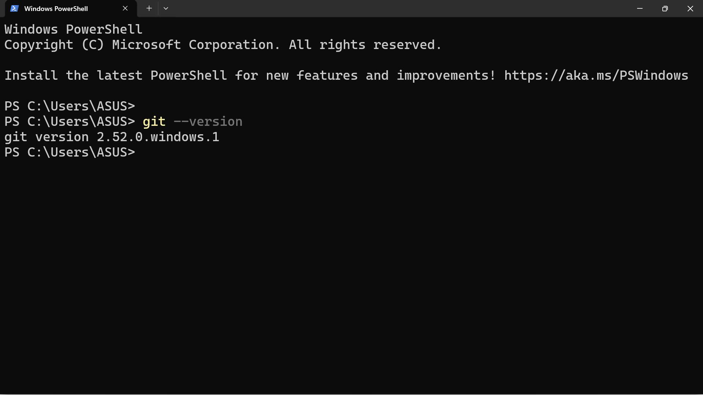
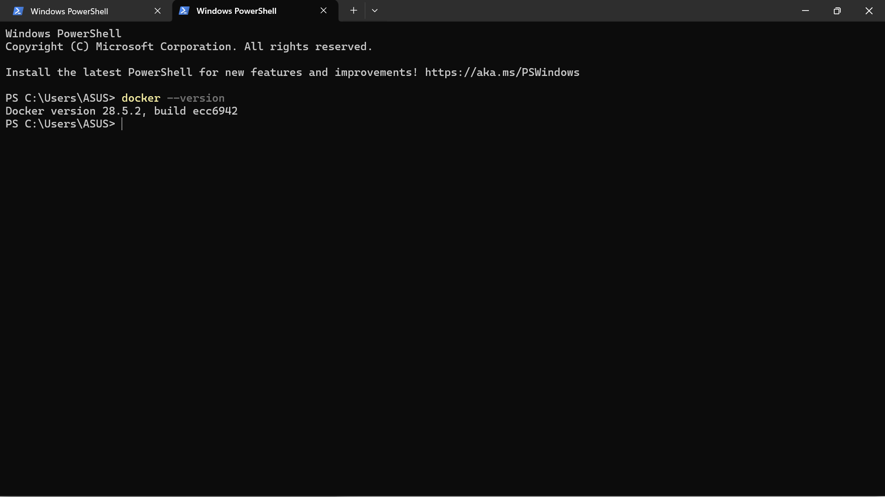
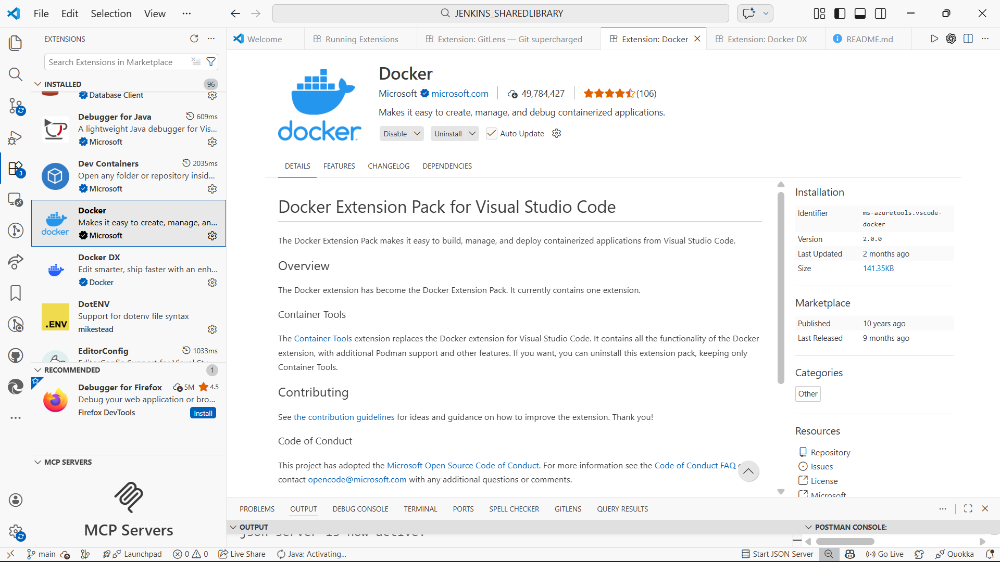
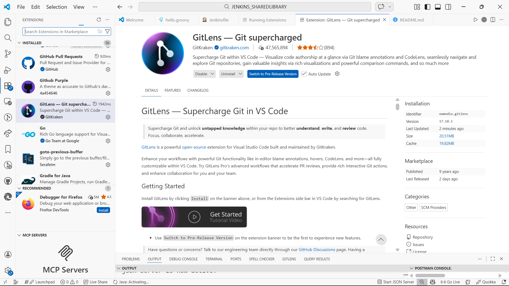
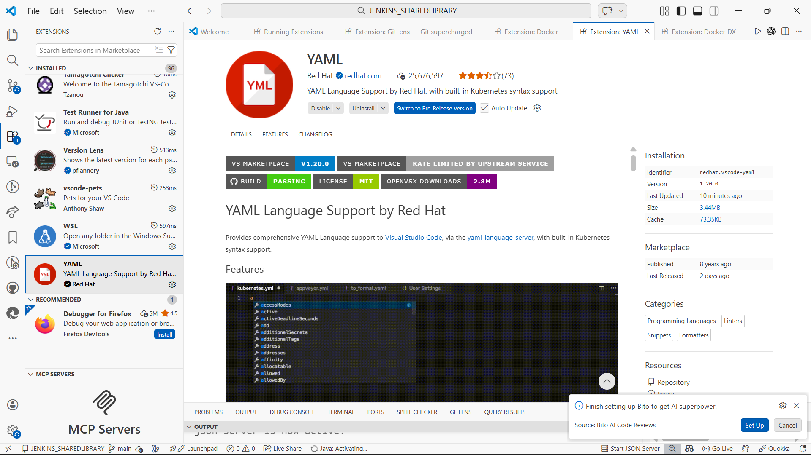

# Laporan Praktikum Pertemuan 01: DevOps Culture & Principles

**Nama:** Rizki Amalia Rasyid Ridha  
**NIM:** 105841121223  
**Kelas/Mata Kuliah:** 5 RPL B/DEVOPS AND CI/CD PIPELINES

---

## 📚 1. Penjelasan DevOps dan Mengapa Penting

### Apa itu DevOps?
**DevOps** (gabungan dari *Development* dan *Operations*) adalah sebuah budaya, filosofi, dan praktik kerja yang menyatukan tim pengembangan perangkat lunak dengan tim operasional IT. Tujuannya adalah untuk meningkatkan kolaborasi, mengotomatisasi proses, dan mempercepat siklus pengiriman perangkat lunak (software delivery) tanpa mengorbankan kualitas.

### Mengapa DevOps Penting?
DevOps sangat penting diterapkan karena memberikan beberapa keuntungan utama, antara lain:
1. **Kecepatan (Speed):** Mempercepat waktu rilis aplikasi ke pengguna.
2. **Kolaborasi yang Lebih Baik:** Menghilangkan "dinding" pemisah antara tim *Dev* dan *Ops*, sehingga mereka bisa bekerja sama menuju tujuan yang sama.
3. **Keandalan (Reliability):** Dengan praktik seperti *Continuous Integration/Continuous Delivery* (CI/CD) dan monitoring, kualitas aplikasi lebih terjamin.
4. **Efisiensi & Otomatisasi:** Mengurangi tugas-tugas manual yang repetitif, meminimalisir *human error*, dan meningkatkan produktivitas.

---

## 🔧 2. Setup Development Environment (Screenshots)

Berikut adalah bukti dokumentasi lingkungan pengembangan yang telah disiapkan:

### A. Git Version
*(Screenshot terminal yang menunjukkan versi Git)*

### B. Docker Version
*(Screenshot terminal yang menunjukkan versi Docker )*

### C. Visual Studio Code Setup
*(Screenshot VS Code yang menampilkan ekstensi Docker, GitLens, dan YAML yang sudah terinstal)*

