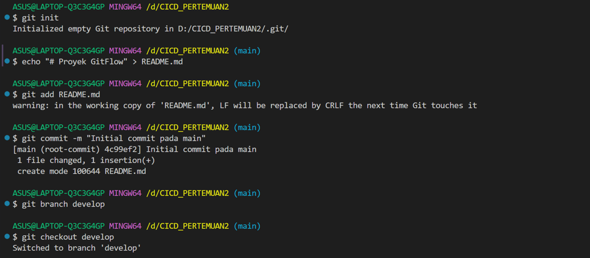
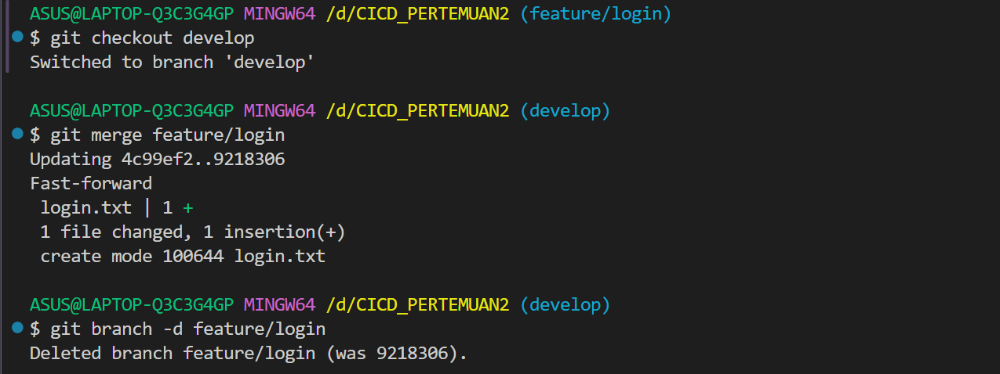
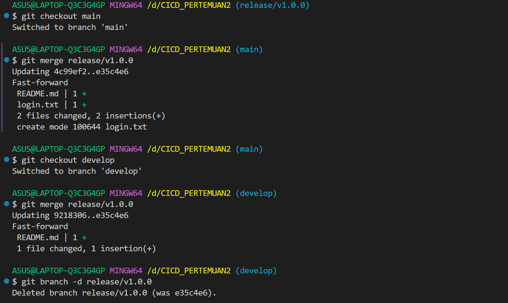
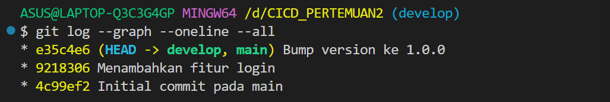
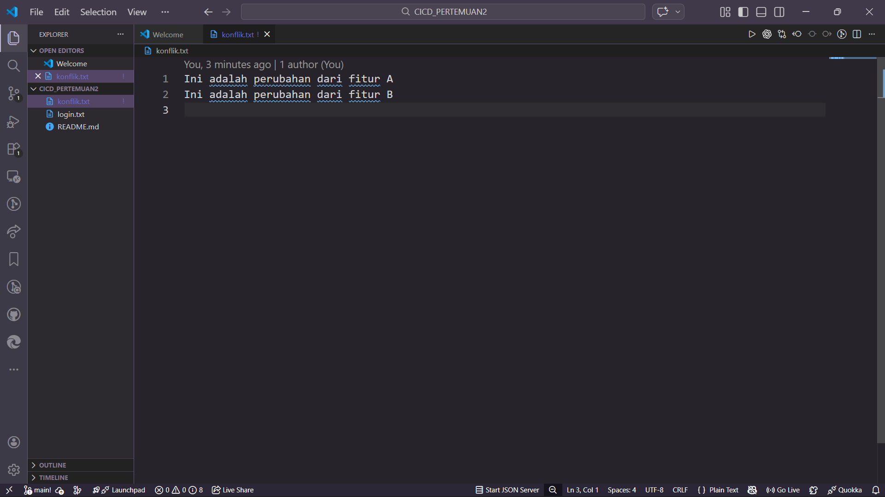

# Laporan Praktikum Pertemuan 02: Git Advanced - Branching Strategies

**Nama:** Rizki Amalia Rasyid Ridha  
**NIM:** 105841121223  
**Kelas/Mata Kuliah:** 5 RPL B/DEVOPS AND CI/CD PIPELINES

---

## 🌿 Task 1: Implementasi GitFlow

Pada praktikum ini, saya mengimplementasikan alur kerja **GitFlow** menggunakan terminal MSYS MinGW (Git Bash). Berikut adalah tahapan perintah yang dieksekusi:

1. **Inisialisasi & Setup Utama:** Menginisialisasi repositori Git (`git init`), membuat file dasar, melakukan *commit* awal pada `main`, dan membuat serta berpindah ke branch `develop`. 
2. **Feature Branch:** Membuat branch `feature/login` dari `develop`, menambahkan simulasi fitur pada file `login.txt`, dan melakukan *commit*. 
3. **Merge Feature ke Develop:** Berpindah kembali ke `develop`, menggabungkan (*merge*) `feature/login`, lalu menghapus branch feature yang sudah selesai. 
4. **Release Branch:** Membuat branch `release/v1.0.0` dari `develop`, menyimulasikan persiapan rilis (*bump version* pada `README.md`), dan melakukan *commit*. 
5. **Merge Release:** Menggabungkan branch release ke `main` (untuk *production*) dan juga ke `develop` (untuk sinkronisasi), lalu menghapus branch release tersebut. 

**Bukti Screenshot GitFlow Branches:**
*(Diambil menggunakan perintah `git log --graph --oneline --all` di Git Bash)*

---

## ⚔️ Task 2: Resolve Merge Conflicts

### Dokumentasi Proses Resolusi Konflik
Saya menyimulasikan bentrok (*merge conflict*) dan menyelesaikannya dengan langkah-langkah berikut:

1. **Persiapan Skenario Konflik:** Saya membuat dua branch baru (`fitur-a` dan `fitur-b`) dari `main`. Pada masing-masing branch, saya memodifikasi baris yang sama pada file `konflik.txt` dengan isi teks yang berbeda, lalu men-commit-nya. 
2. **Memicu Konflik:** Saya melakukan *merge* branch `fitur-a` ke `main` secara mulus. Namun, ketika mencoba melakukan *merge* branch `fitur-b` ke `main`, Git menolak secara otomatis dan memunculkan peringatan `CONFLICT (add/add)`. 
3. **Resolusi di VS Code:** - Saya membuka proyek di Visual Studio Code (menggunakan perintah `code .`).
   - Saya membuka file `konflik.txt` dan memanfaatkan antarmuka VS Code untuk memilih perubahan mana yang dipertahankan (menyelesaikan konflik secara manual). 
   - Setelah selesai, saya menyimpan (*save*) file tersebut. 
4. **Penyelesaian Akhir:** Saya kembali ke terminal MinGW, lalu menjalankan perintah `git add konflik.txt` dan `git commit` untuk menyelesaikan status *merge* yang menggantung. 

**Bukti Screenshot Resolusi Konflik:**
*(Tangkapan layar saat proses resolusi konflik di dalam Visual Studio Code)*

